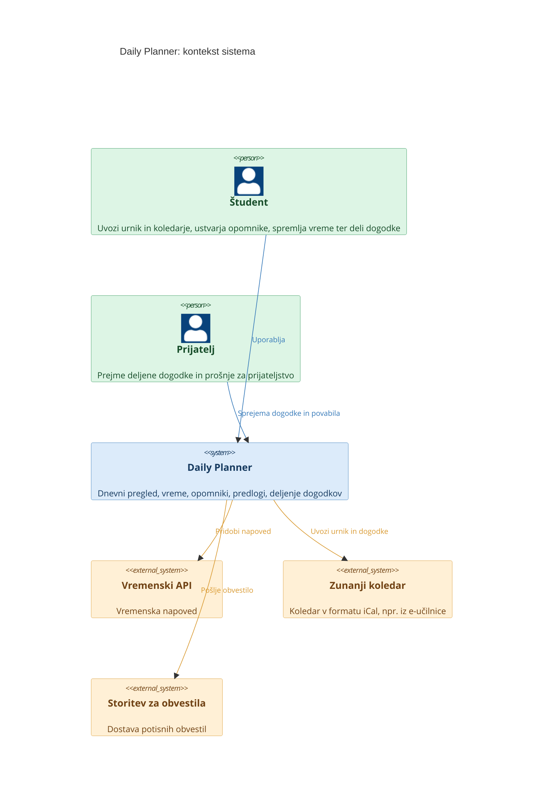

# C4 kontekst

Diagram prikazuje, kdo uporablja Daily Planner in s katerimi zunanjimi
sistemi se povezuje.

```mermaid
C4Context
    title Daily Planner: kontekst sistema

    Person(student, "Študent", "Uvozi urnik in koledarje, ustvarja opomnike, spremlja vreme ter deli dogodke")
    Person(friend, "Prijatelj", "Prejme deljene dogodke in prošnje za prijateljstvo")

    System(planner, "Daily Planner", "Dnevni pregled, vreme, opomniki, predlogi, deljenje dogodkov")

    System_Ext(weather, "Vremenski API", "Vremenska napoved")
    System_Ext(calendar, "Zunanji koledar", "Koledar v formatu iCal, npr. iz e-učilnice")
    System_Ext(notification, "Storitev za obvestila", "Dostava potisnih obvestil")

    Rel(student, planner, "Uporablja")
    Rel(friend, planner, "Sprejema dogodke in povabila")
    Rel(planner, weather, "Pridobi napoved")
    Rel(planner, calendar, "Uvozi urnik in dogodke")
    Rel(planner, notification, "Pošlje obvestilo")

    UpdateElementStyle(planner, $bgColor="#DCEBFA", $fontColor="#163A5F", $borderColor="#3478B8")
    UpdateElementStyle(student, $bgColor="#DDF5E5", $fontColor="#174D2A", $borderColor="#31945A")
    UpdateElementStyle(friend, $bgColor="#DDF5E5", $fontColor="#174D2A", $borderColor="#31945A")
    UpdateElementStyle(weather, $bgColor="#FFF0D6", $fontColor="#704214", $borderColor="#D99A32")
    UpdateElementStyle(calendar, $bgColor="#FFF0D6", $fontColor="#704214", $borderColor="#D99A32")
    UpdateElementStyle(notification, $bgColor="#FFF0D6", $fontColor="#704214", $borderColor="#D99A32")

    UpdateRelStyle(student, planner, $textColor="#3478B8", $lineColor="#3478B8")
    UpdateRelStyle(friend, planner, $textColor="#3478B8", $lineColor="#3478B8")
    UpdateRelStyle(planner, weather, $textColor="#D99A32", $lineColor="#D99A32")
    UpdateRelStyle(planner, calendar, $textColor="#D99A32", $lineColor="#D99A32")
    UpdateRelStyle(planner, notification, $textColor="#D99A32", $lineColor="#D99A32")

    UpdateLayoutConfig($c4ShapeInRow="2", $c4BoundaryInRow="1")
```